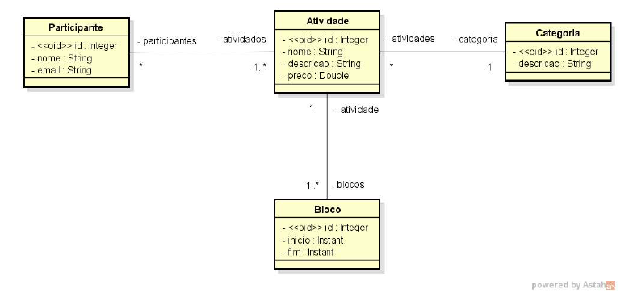

<h1 align="center"> Evento </h1>

  <a href="#-tecnologias">Tecnologias</a>&nbsp;&nbsp;&nbsp;|&nbsp;&nbsp;&nbsp;
  <a href="#-projeto">Projeto</a>&nbsp;&nbsp;&nbsp;|&nbsp;&nbsp;&nbsp;

 

  

## 🚀 Tecnologias

Esse projeto foi desenvolvido com as seguintes tecnologias:

- Java
- Maven
- Spring Boot
- Spring Data JPA
- Hibernate
- Lombok
- H2 Database
- Git e Github

## 💻 Projeto

É um projeto com ambiente de testes configurado acessando o banco de dados H2 com alguns relacionamentos e com seeding de dados em todas as tabelas.
